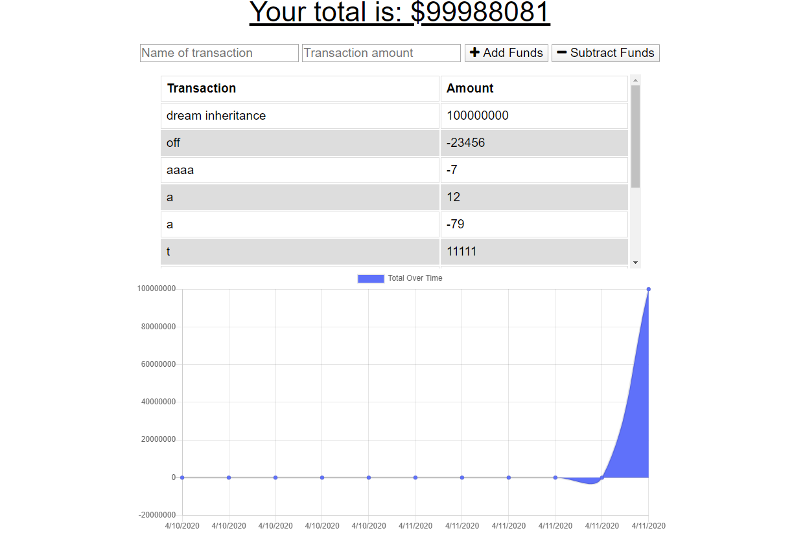

# budget-tracker
by Garrett Reichman
https://ancient-forest-39507.herokuapp.com/
## Description
   This is a simple budget tracking app. It was made to experience creating a progressive web app. It allows the user to add transactions to their budget (both deposits and withdrawals). The app will keep track of each transaction, the grand total, as well as display the transactions on a chart. If the user loses connection, the site will store any new transactions into indexdb and attempt to submit them once the connection has been re-established.
## Usage
   To use this app, go to the link displayed above. To add a new transaction, enter a name for the transaction, the amount transferred, then select if it was a deposit or withdrawal. The chart below the transaction list will track your expenses and your total amount of available money will be shown at the top of the page.

## Known Issues
   Hosted site currently doesnt load
